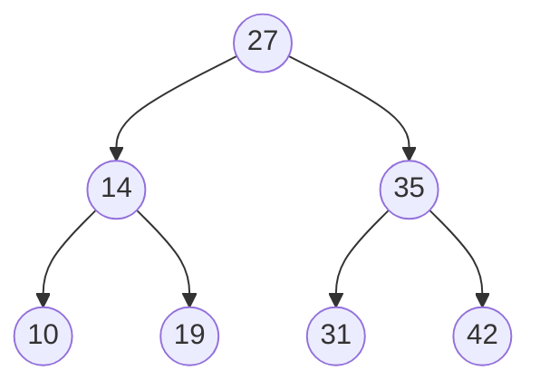
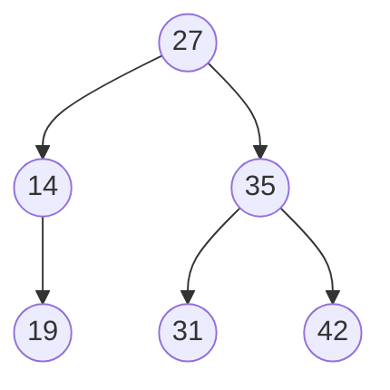
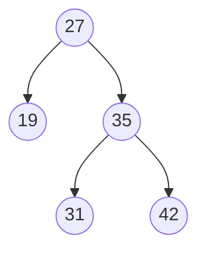
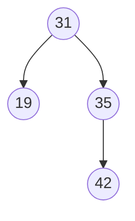

# Bonus — bst_remove

## Original seven-key tree

```mermaid
graph TD
    A((27)) --> B((14))
    A --> C((35))
    B --> D((10))
    B --> E((19))
    C --> F((31))
    C --> G((42))
```

## After removing 10 (leaf)

```mermaid
graph TD
    A((27)) --> B((14))
    A --> C((35))
    B --> E((19))
    C --> F((31))
    C --> G((42))
```

## After removing 14 (one child)

```mermaid
graph TD
    A((27)) --> B((19))
    A --> C((35))
    C --> F((31))
    C --> G((42))
```

## After removing 27 (two children)

```mermaid
graph TD
    A((31)) --> B((19))
    A --> C((35))
    C --> G((42))
```
